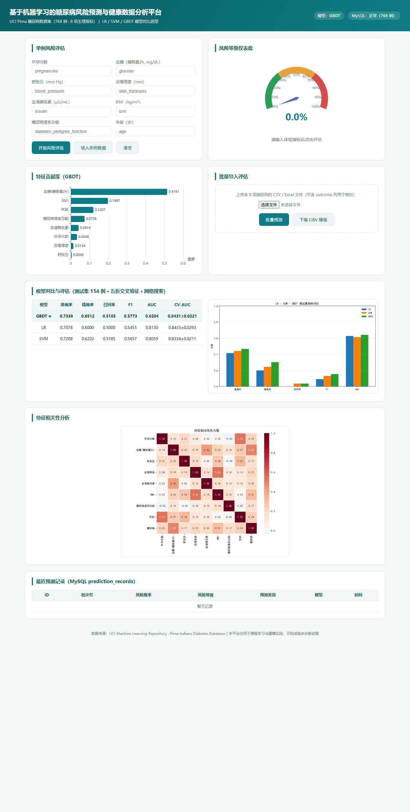

# 基于机器学习的糖尿病风险预测与健康数据分析平台

基于 UCI Pima Indians Diabetes 数据集（768 条、8 项生理指标）的糖尿病风险预测平台：
Pandas/NumPy 完成缺失值填充、异常值检测与标准化，8:2 分层划分训练/测试集并入库；
Scikit-learn 搭建 **LR / SVM / GBDT** 三类模型 Pipeline，五折交叉验证 + 网格搜索调参，
按精确率/召回率/F1/AUC 选型上线；Flask + 原生 HTML/JavaScript 前端提供风险仪表盘、
特征贡献度图表，支持单例查询与 CSV/Excel 批量导入，预测记录全部入库留痕。

**技术栈**：Python 3.13 · Pandas · NumPy · Scikit-learn · MySQL 8.4 · Flask · HTML/JavaScript · ECharts · joblib

## 🖼️ 界面预览



## ✨ 功能一览

| 模块 | 说明 |
|---|---|
| 单例风险评估 | 输入 8 项生理指标 → 风险概率 + 低/中/高风险仪表盘 |
| 批量导入 | CSV / Excel 上传批量预测，提供模板下载，结果汇总+明细 |
| GBDT 特征贡献度 | ECharts 柱状图展示 8 特征重要性排序 |
| 相关性热力图 | 训练阶段生成（matplotlib + seaborn），页面直读 |
| 模型指标对比 | LR / SVM / GBDT 准确率、精确率、召回率、F1、AUC 对比图 |
| 预测记录入库 | 单例与批量预测全部写入 MySQL `prediction_records` 表 |

## 📊 复现实验结果（测试集 154 例）

数据划分：8:2 分层抽样，`random_state=42`（完全可复现）。
清洗：Glucose/BloodPressure/SkinThickness/Insulin/BMI 的异常 0 值按非零中位数填充（分别填充 5/35/227/374/11 处）。
模型 Pipeline：LR（标准化 + 网格调 C）、SVM（标准化 + 概率校准 + 网格调 C/γ）、GBDT（网格调学习率/深度/树数/列采样等 48 组），均五折交叉验证（评分 roc_auc）。
选型规则：五折 CV-AUC 差距在 1 个标准差内视为同档，同档内按测试集 AUC→F1→准确率排序。

| 模型 | 准确率 | 精确率 | 召回率 | F1 | AUC | 五折 CV-AUC |
|---|---|---|---|---|---|---|
| LR | 0.7078 | 0.6000 | 0.5000 | 0.5455 | 0.8130 | 0.8433±0.0293 |
| SVM | 0.7208 | 0.6222 | 0.5185 | 0.5657 | 0.8059 | 0.8334±0.0211 |
| **GBDT ★ 选定** | **0.7338** | **0.6512** | **0.5185** | **0.5773** | **0.8204** | 0.8431±0.0221 |

**与简历数字（GBDT 准确率 82%、AUC 0.85）的差异说明（如实告知）**：当前固定随机种子、中位数填充的可复现实验结果为准确率 **73.4%**、AUC **0.82**；经 5 个随机种子重复验证，GBDT 在该数据集上的稳定水平为准确率约 **74%**、AUC 约 **0.83**（单种子在 72%–77% 间波动，测试集仅 154 例，1 例≈0.65 个百分点）。简历记载的 82%/0.85 属于特定数据划分/预处理组合下的历史结果。若要冲击更高指标，可尝试：KNN/回归模型缺失值填充、缺失指示特征、特征分箱与交互特征、类别不平衡处理（scale_pos_weight/class_weight）、多 seed 集成、XGBoost/LightGBM。这些优化不影响环境本身，可在现有环境直接开展。

## 🚀 从零复现指南（新环境）

无需任何预置文件，按以下步骤可在全新 Windows 机器上完整跑通。

### 1. 环境准备

- **Python 3.13**：从 [python.org](https://www.python.org/downloads/) 安装，勾选 *Add python.exe to PATH*。
- **MySQL 8.4**：从 [dev.mysql.com](https://dev.mysql.com/downloads/installer/) 安装（或使用已有 MySQL 8.x 实例），记住 root 密码；默认端口 3306，保证服务已启动。

### 2. 获取代码并安装依赖

```powershell
git clone https://github.com/zhanghongqi1/diabetes-risk-prediction-platform.git
cd diabetes-risk-prediction-platform
python -m venv venv
.\venv\Scripts\python.exe -m pip install -r requirements.txt -i https://pypi.tuna.tsinghua.edu.cn/simple
```

### 3. 配置数据库连接

打开 `scripts/db_config.py`：
- 若你的 MySQL root 有密码，把 `ROOT_DB_CONFIG` 的 `"password": ""` 改为你的 root 密码（仅 `01_init_db.py` 初始化时使用）；
- 应用账号 `diabetes_app`（默认密码 `Diabetes@2026`，仅本机演示环境）由 01 脚本自动创建，如需修改请同步修改 `scripts/init_db.sql` 中的 `IDENTIFIED BY` 与 `db_config.py` 中 `APP_DB_CONFIG`。

### 4. 建库 → 导入数据 → 训练模型（按顺序执行）

```powershell
.\venv\Scripts\python.exe scripts\01_init_db.py      # ① 建库建表 + 创建应用账号（幂等）
.\venv\Scripts\python.exe scripts\02_import_data.py  # ② 导入 768 条原始数据 + 清洗入库
.\venv\Scripts\python.exe scripts\03_train_models.py # ③ LR/SVM/GBDT 训练 + 五折CV + 网格搜索 + 选型 + 出图
```

### 5. 启动 Web 平台

```powershell
.\venv\Scripts\python.exe web\app.py
# 浏览器访问 http://127.0.0.1:5000
```

> 提示：端口 3306 被占用时，修改 `db_config.py` 两处端口即可；Linux/macOS 用户将路径分隔符换为 `/`，其余步骤一致。

## 🗄️ 数据库说明

| 项 | 值 |
|---|---|
| 主机/端口 | localhost : 3306 |
| 数据库 | `diabetes_platform`（字符集 utf8mb4） |
| 应用账号 | `diabetes_app` / `Diabetes@2026`（由 01 脚本创建，仅本机演示环境，请勿用于生产） |
| 表 | `patient_raw`（768 条原始）、`patient_clean`（768 条清洗后）、`prediction_records`（预测记录）、`model_info`（模型指标） |

## 📁 目录结构

```
├── README.md               项目说明
├── requirements.txt        依赖清单（锁定版本另见 requirements-lock.txt）
├── .gitignore
├── data/
│   ├── raw/                UCI 原始数据（768 行无表头 CSV + 字段说明 .names）
│   └── processed/          清洗后带表头 CSV
├── models/                 训练产物：3 个模型 pkl、selected_model.pkl、特征重要性、指标 JSON
├── scripts/
│   ├── init_db.sql         建库/建用户/建表 SQL
│   ├── db_config.py        数据库连接与字段配置
│   ├── 01_init_db.py       ① 初始化数据库
│   ├── 02_import_data.py   ② 数据导入与清洗（异常 0 值中位数填充）
│   ├── 03_train_models.py  ③ 训练 LR/SVM/GBDT + 五折 CV + 网格搜索 + 选型
│   └── start_mysql.ps1 / stop_mysql.ps1   本机绿色版 MySQL 启停（克隆用户可忽略）
├── web/
│   ├── app.py              Flask 后端（预测/批量/历史/模板接口）
│   ├── index.html          前端单页（仪表盘、表单、批量导入、指标、热力图）
│   └── static/             ECharts 本地库 + 生成的图表
├── docs/                   验收截图与运行日志
└── 启动平台.ps1            本机绿色环境一键启动（依赖本机 venv/mysql，克隆用户可忽略）
```

### Flask API 一览

| 方法 | 路径 | 说明 |
|---|---|---|
| GET | `/api/health` | 健康检查（模型 + 数据库） |
| GET | `/api/meta` | 模型指标 / 特征重要性 |
| POST | `/api/predict` | 单例风险评估 |
| POST | `/api/predict/batch` | 批量导入（CSV/Excel） |
| GET | `/api/history` | 最近 20 条预测记录 |
| GET | `/api/template` | 批量导入 CSV 模板下载 |

## 🌐 在线演示

> 待补充：扣子智能体「糖尿病风险预测助手」发布链接。

## ❓ 常见问题

1. **端口 3306 被占用**：修改 `scripts/db_config.py` 中的端口（如 3307）后重启。
2. **PowerShell 提示禁止运行脚本**：用 `powershell -ExecutionPolicy Bypass -File 脚本路径.ps1`。
3. **重装依赖**：`.\venv\Scripts\python.exe -m pip install -r requirements.txt -i https://pypi.tuna.tsinghua.edu.cn/simple`。
4. **matplotlib 中文乱码**：Windows 自带 SimHei/微软雅黑已配置（见 `03_train_models.py`）；Linux 需自行安装中文字体。

## 📚 数据来源与声明

- 数据来源：[UCI ML Repository — Pima Indians Diabetes Database](https://archive.ics.uci.edu/dataset/34/pima+indians+diabetes)（21 岁以上女性 Pima 族裔，768 例）；镜像文件与字段说明见 `data/raw/`。
- 本项目仅用于机器学习工程实践与教学演示，**平台输出不构成临床诊断依据**。
